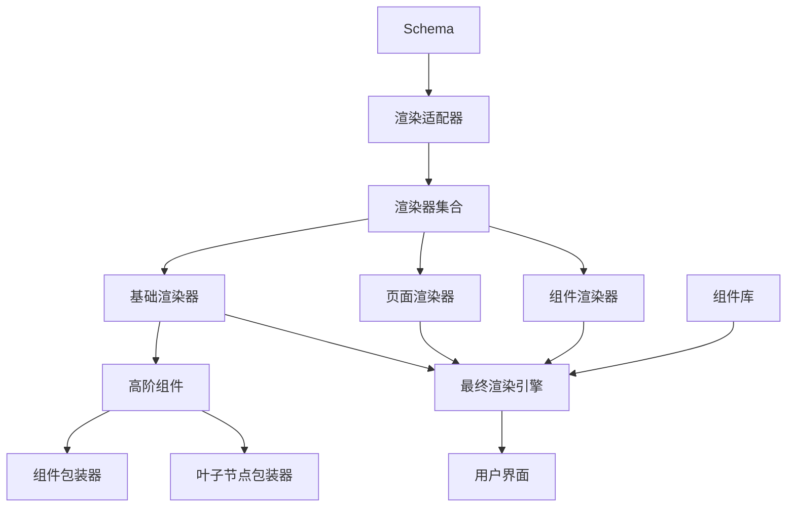

# 自定义渲染器开发

EasyEditor 提供了灵活的渲染器架构，允许开发者创建自定义渲染器以支持不同的框架或特定场景需求。本文将指导你如何开发自定义渲染器。

## 渲染器原理

在 EasyEditor 中，渲染器负责将 Schema 转换为实际的 UI 界面。渲染器遵循以下工作流程：

1. **解析 Schema** - 将 JSON 描述解析为内部数据结构
2. **映射组件** - 将组件名称映射到实际组件实现
3. **属性处理** - 处理组件属性，如事件绑定、样式计算等
4. **渲染组件** - 将组件渲染到 DOM 中

### 渲染器架构

EasyEditor 的渲染器架构由以下部分组成：



## 创建基本渲染器

### 1. 定义渲染器接口

首先，我们需要定义渲染器的基本接口：

```tsx
// 从核心库引入类型
import type { Schema } from '@easy-editor/core'
import React from 'react'

// 渲染器属性接口
export interface RendererProps {
  // 要渲染的 Schema
  schema: Schema;
  // 组件映射表
  components: Record<string, React.ComponentType<any>>;
  // 全局属性
  globalProps?: Record<string, any>;
  // 组件属性处理器
  propsReducers?: Array<(props: Record<string, any>) => Record<string, any>>;
  // 应用辅助对象
  appHelper?: {
    utils: Record<string, (...args: any[]) => any>;
    ctx: Record<string, any>;
  };
}

// 视口增强的渲染器属性接口
interface CustomRendererProps extends RendererProps {
  viewport?: {
    width?: number;
    height?: number;
  }
}

const CustomRenderer: React.FC<CustomRendererProps> = (props) => {
  const { schema, components, viewport } = props;
  const { width = 1920, height = 1080 } = viewport || {};

  // 渲染器实现逻辑
  return (
    <div className="easy-editor">
      <div className="easy-editor-canvas">
        <div
          className="easy-editor-viewport"
          style={{ width, height }}
        >
          <div className="easy-editor-content">
            {/* 核心渲染逻辑 */}
          </div>
        </div>
      </div>
    </div>
  );
};

export default CustomRenderer;
```

### 2. 构建渲染器工厂函数

参考 EasyEditor 的渲染器模型，我们需要创建工厂函数来生成不同类型的渲染器：

```tsx
import {
  adapter,
  rendererFactory,
  componentRendererFactory,
  pageRendererFactory,
  baseRendererFactory
} from '@easy-editor/react-renderer'

// 创建自定义基础渲染器
export const customBaseRendererFactory = () => {
  const OriginBase = baseRendererFactory();

  return class BaseRenderer extends OriginBase {
    // 自定义组件高阶组件链
    get __componentHOCs() {
      if (this.__designModeIsDesign) {
        // 设计模式下的 HOC 链
        return [customWrapper, leafWrapper, compWrapper];
      }
      // 运行模式下的 HOC 链
      return [customWrapper, compWrapper];
    }
  }
}

// 设置适配器
adapter.setBaseRenderer(customBaseRendererFactory());
adapter.setRenderers({
  PageRenderer: pageRendererFactory(),
  ComponentRenderer: componentRendererFactory(),
});

// 导出最终渲染器
export const CustomRenderer = rendererFactory();
```

### 3. 实现组件包装器 (HOC)

为了支持自定义的渲染行为，我们需要实现组件包装器：

```tsx
import { type ComponentHocInfo, createForwardRefHocElement } from '@easy-editor/react-renderer'
import React, { Component } from 'react'

export function customWrapper(Comp: any, { schema, baseRenderer, componentInfo }: ComponentHocInfo) {
  // 获取上下文信息
  const host = baseRenderer.props?.__host
  const isDesignMode = host?.designMode === 'design'

  // 定义包装组件类
  class Wrapper extends Component<any> {
    render() {
      const { forwardRef, children, className, ...rest } = this.props

      // 处理特殊情况
      if (schema.isRoot) {
        return (
          <Comp ref={forwardRef} {...rest}>
            {children}
          </Comp>
        )
      }

      // 普通组件渲染逻辑
      return (
        <div className="custom-component-container">
          <Comp
            ref={forwardRef}
            className={`custom-component ${className || ''}`}
            {...rest}
          >
            {children}
          </Comp>
        </div>
      )
    }
  }

  // 设置显示名称
  (Wrapper as any).displayName = Comp.displayName

  // 创建转发引用的 HOC 元素
  return createForwardRefHocElement(Wrapper, Comp)
}
```

## 特定场景渲染器案例

### 大屏渲染器实现

以下是大屏渲染器的实现案例，展示了如何处理绝对定位组件和坐标系：

```tsx
import { useRef } from 'react'
import { LowCodeRenderer } from '../renderer-core/renderer'
import { useResizeObserver } from '../hooks/useResizeObserver'

// 大屏渲染器属性接口
interface DashboardRendererProps extends RendererProps {
  viewport?: {
    width?: number;
    height?: number;
  };
}

const DashboardRenderer: React.FC<DashboardRendererProps> = props => {
  const { viewport, ...rendererProps } = props
  const { width: viewportWidth = 1920, height: viewportHeight = 1080 } = viewport || {}

  // 引用DOM元素
  const canvasRef = useRef<HTMLDivElement>(null)
  const viewportRef = useRef<HTMLDivElement>(null)

  // 监听画布大小变化，自动调整缩放比例
  useResizeObserver({
    elem: canvasRef,
    onResize: entries => {
      const { width, height } = entries[0].contentRect
      const ww = width / viewportWidth
      const wh = height / viewportHeight
      viewportRef.current!.style.transform = `scale(${Math.min(ww, wh)}) translate(-50%, -50%)`
    },
  })

  return (
    <div className='easy-editor'>
      {/* 画布容器 */}
      <div ref={canvasRef} className='easy-editor-canvas'>
        {/* 视口容器 */}
        <div
          ref={viewportRef}
          className='easy-editor-viewport'
          style={{
            width: viewportWidth,
            height: viewportHeight,
          }}
        >
          {/* 内容区域 */}
          <div className='easy-editor-content'>
            {/* 渲染器核心 */}
            <LowCodeRenderer {...(rendererProps as RendererProps)} />
          </div>
        </div>
      </div>
    </div>
  )
}

export default DashboardRenderer
```

### 大屏组件包装器实现

大屏场景中的组件需要特殊的定位和坐标系处理：

```tsx
import type { NodeSchema } from '@easy-editor/core'
import { type ComponentHocInfo, createForwardRefHocElement } from '@easy-editor/react-renderer'
import { Component } from 'react'

export function dashboardWrapper(Comp: any, { schema, baseRenderer }: ComponentHocInfo) {
  // 获取上下文信息
  const host = baseRenderer.props?.__host
  const isDesignMode = host?.designMode === 'design'
  // 大屏配置信息
  let { mask = true } = host?.dashboardStyle || {}

  // 非设计模式下，不显示遮罩
  if (!isDesignMode) {
    mask = false
  }

  class Wrapper extends Component<any> {
    render() {
      const { forwardRef, children, className, ...rest } = this.props
      // 计算节点位置和尺寸
      const rect = computeRect(schema)

      if (!rect) {
        return null
      }

      // 根节点特殊处理
      if (schema.isRoot) {
        return (
          <Comp ref={forwardRef} {...rest}>
            {children}
          </Comp>
        )
      }

      // 常规节点渲染，包含坐标定位
      return (
        // 容器层
        <div
          className={`easy-editor-component-container ${mask ? 'mask' : ''}`}
          style={{
            left: rect.x,
            top: rect.y,
            width: rect.width,
            height: rect.height,
          }}
        >
          {/* 重置坐标系 */}
          <div
            style={{
              position: 'absolute',
              left: -rect.x!,
              top: -rect.y!,
            }}
          >
            {/* 组件坐标定位 */}
            <div
              ref={forwardRef}
              className='easy-editor-component-mask'
              style={{
                left: rect.x!,
                top: rect.y!,
                width: rect.width,
                height: rect.height,
              }}
            >
              {/* 组件渲染 */}
              <Comp className={`easy-editor-component ${mask ? 'mask' : ''} ${className || ''}`} {...rest}>
                {children && (
                  // 再次重置坐标系，用于内部组件定位
                  <div
                    style={{
                      position: 'absolute',
                      left: -rect.x!,
                      top: -rect.y!,
                    }}
                  >
                    {children}
                  </div>
                )}
              </Comp>
            </div>
          </div>
        </div>
      )
    }
  }
  ;(Wrapper as any).displayName = Comp.displayName

  return createForwardRefHocElement(Wrapper, Comp)
}

/**
 * 计算节点在大屏中的位置信息
 */
const computeRect = (node: NodeSchema) => {
  // 处理非组节点
  if (!node.isGroup || !node.children || node.children.length === 0) {
    return node.$dashboard?.rect
  }

  // 计算组节点的包围盒
  let [minX, minY, maxX, maxY] = [
    Number.POSITIVE_INFINITY,
    Number.POSITIVE_INFINITY,
    Number.NEGATIVE_INFINITY,
    Number.NEGATIVE_INFINITY,
  ]

  // 遍历所有子节点
  for (const child of node.children) {
    let childRect: any
    if (child.isGroup) {
      childRect = computeRect(child)
    } else {
      childRect = child.$dashboard?.rect
    }
    const x = childRect?.x
    const y = childRect?.y
    const width = childRect?.width || 0
    const height = childRect?.height || 0

    minX = Math.min(minX, x)
    minY = Math.min(minY, y)
    maxX = Math.max(maxX, x + width)
    maxY = Math.max(maxY, y + height)
  }

  return {
    x: minX,
    y: minY,
    width: maxX - minX,
    height: maxY - minY,
  }
}
```

## 增强自定义渲染器

### 1. 添加错误边界

为了提高渲染器的健壮性，我们可以添加错误边界：

```tsx
// 错误边界组件
class ErrorBoundary extends React.Component<
  { componentName: string; children: React.ReactNode },
  { hasError: boolean; error: Error | null }
> {
  constructor(props: any) {
    super(props);
    this.state = { hasError: false, error: null };
  }

  static getDerivedStateFromError(error: Error) {
    return { hasError: true, error };
  }

  componentDidCatch(error: Error, errorInfo: React.ErrorInfo) {
    console.error(`Error rendering ${this.props.componentName}:`, error, errorInfo);
  }

  render() {
    if (this.state.hasError) {
      return (
        <div className="easy-editor-error-boundary">
          <h3>组件渲染错误</h3>
          <p>组件: {this.props.componentName}</p>
          <p>错误: {this.state.error?.message}</p>
        </div>
      );
    }

    return this.props.children;
  }
}

// 在渲染组件时使用错误边界
function renderComponent(
  schema: Schema,
  components: Record<string, React.ComponentType<any>>,
  context: any
) {
  const { componentName } = schema;
  // ...其他代码

  return (
    <ErrorBoundary componentName={componentName}>
      {/* 渲染组件的代码 */}
    </ErrorBoundary>
  );
}
```

### 2. 添加性能优化

使用 React.memo 和其他优化技术提高渲染性能：

```tsx
import React, { memo, useMemo, useCallback } from 'react';

// 使用 memo 优化渲染器组件
const OptimizedComponent = memo(
  ({ schema, components, context }: RenderComponentProps) => {
    // 使用 useMemo 缓存计算结果
    const processedProps = useMemo(() => {
      return processProps(schema.props || {}, context);
    }, [schema.props, context]);

    // 使用 useCallback 优化事件处理函数
    const handleEvent = useCallback((eventName: string, ...args: any[]) => {
      // 事件处理逻辑
    }, [context]);

    // 渲染逻辑
    return (/* 组件渲染代码 */);
  },
  // 自定义比较函数，避免不必要的重渲染
  (prevProps, nextProps) => {
    // 仅当 schema 或关键上下文发生变化时才重渲染
    return (
      prevProps.schema === nextProps.schema &&
      prevProps.components === nextProps.components &&
      prevProps.context.version === nextProps.context.version
    );
  }
);
```

### 3. 支持组件通信

实现组件间通信机制：

```tsx
// 创建事件总线
class EventBus {
  private listeners: Record<string, Array<(...args: any[]) => void>> = {};

  // 订阅事件
  on(event: string, callback: (...args: any[]) => void) {
    if (!this.listeners[event]) {
      this.listeners[event] = [];
    }
    this.listeners[event].push(callback);
    return () => this.off(event, callback);
  }

  // 取消订阅
  off(event: string, callback: (...args: any[]) => void) {
    if (!this.listeners[event]) return;
    this.listeners[event] = this.listeners[event].filter(cb => cb !== callback);
  }

  // 触发事件
  emit(event: string, ...args: any[]) {
    if (!this.listeners[event]) return;
    this.listeners[event].forEach(callback => {
      try {
        callback(...args);
      } catch (error) {
        console.error(`Error in event listener for ${event}:`, error);
      }
    });
  }
}

// 创建上下文
const createRendererContext = () => {
  const eventBus = new EventBus();

  return {
    // 事件系统
    event: {
      on: eventBus.on.bind(eventBus),
      off: eventBus.off.bind(eventBus),
      emit: eventBus.emit.bind(eventBus)
    },
    // 共享状态
    shared: new Map(),
    // 设置/获取共享状态
    setShared: (key: string, value: any) => {
      context.shared.set(key, value);
      eventBus.emit(`shared:${key}:change`, value);
    },
    getShared: (key: string) => context.shared.get(key)
  };
};
```

## 适配其他框架

:::warning 开发中
适配其他框架（如 Vue、Angular 等）的功能正在积极开发中。我们计划在未来版本中提供更多框架的支持，让 EasyEditor 能够更好地服务于不同技术栈的项目。

如果你有特定的框架适配需求，欢迎在 GitHub 上提交 Issue 或参与讨论。
:::

## 下一步

- 了解[运行态渲染器](/guide/renderer/runtime)的使用方法
- 探索[插件开发](/guide/extension/plugin)以扩展其他功能
- 查看[API 参考](/reference/renderer)获取更详细的接口定义
